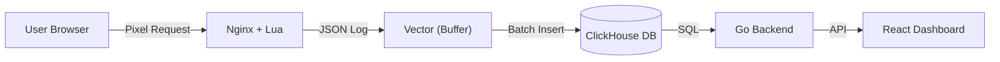

# Pixel

> **⚠️ Status: Active Development (Beta)**
>
> This project is currently in active development. Features, APIs, and database schemas may change without backward compatibility guarantees. Use in production with caution.
>
> We welcome feedback and contributions! Contact - https://t.me/Pamnard

**Pixel** is a high-performance, self-hosted web analytics system built for high-load projects.

Unlike SaaS solutions, Pixel is deployed on your own infrastructure (Docker/K8s), giving you full control over data and no limits on event volume.

## 🚀 Key Features

- **Real-time Analytics:** Events appear in the database and dashboard within seconds.
- **High Performance:**
  - **Nginx + Lua** at the edge handles 50k+ RPS on a single node.
  - **Vector** aggregates and buffers logs.
  - **ClickHouse** stores terabytes of data and executes SQL queries instantly.
- **Privacy-First:** We do NOT collect PII (emails, names) automatically. The system is designed to be privacy-friendly and can be configured for full GDPR compliance.
  - **Stateless Identification:** `visitor_id` is derived from stable device parameters and is NOT stored in cookies or localStorage.
  - **No PII by default:** The tracker actively prevents storing emails as User IDs.
  - **IP Anonymization:** IP addresses are salted and hashed on the edge (Nginx) before storage. We store only MD5 hashes (`ip_hash`) for uniqueness checks, not raw IPs.
- **Lightweight Tracker:** JS tracker weighs only **~2KB** (gzipped) and does not block rendering.
- **AdBlock Bypass:** Works in a First-party context (via Nginx proxy on your main domain), bypassing most ad blockers and ITP.
- **Dashboard:** Built-in admin panel (React + Go) for viewing reports, creating widgets, and managing users.

## 💡 Advanced Tracker Capabilities

Pixel's tracker (`pixel.js`) is designed to capture **more data** with **higher reliability** than standard solutions:

### 🛡️ Guaranteed Data Delivery (Offline Mode)

Unlike standard analytics solutions, Pixel ensures no data is lost even on unstable networks:

- **LocalStorage Backup:** Events are stored locally if the network is down or the server is unreachable.
- **Smart Retries:** Automatically retries failed requests with exponential backoff (up to 24 hours).
- **Page Unload Handling:** Uses `sendBeacon` and `keepalive` fetch to ensure events are sent even when the user closes the tab.

### ⚡ Automatic Event Capture

Out-of-the-box tracking without coding:

- **SPA Support:** Automatically detects route changes in Single Page Applications (React, Vue, Angular) via History API.
- **Interaction Tracking:**
  - **Scroll Depth:** Tracks how far users scroll (0-100%).
  - **Outbound Clicks:** Tracks clicks to external domains.
  - **Form Submissions:** Tracks form usage (without collecting sensitive values).
  - **File Downloads:** Auto-detects download links (PDF, ZIP, etc.).
  - **Visibility:** Tracks when the tab becomes hidden/visible for accurate "Time on Page" metrics.

### 🆔 Robust Visitor Identification (Session Handoff)

- Generates a stable `visitor_id` based on anonymous device signals.
- **Device Matching:** Uses Canvas, WebGL, and AudioContext signals to re-identify visitors even if cookies are lost or they switch from WebView to Browser.
- **Session Linking:** Automatically links sessions across different domains or apps within a 15-minute window (via server-side fingerprint matching).

## 🏗 Architecture

Pixel follows a classic Big Data Pipeline architecture:



1.  **Tracker (JS):** Collects events (pageview, click, custom) and sends them to Nginx.
2.  **Collector (Nginx + Lua):** Receives requests, enriches them (GeoIP, UserAgent parsing), writes to a local log file (NDJSON), and responds with 204 immediately. No synchronous DB writes.
3.  **Pipeline (Vector):** Reads log files, buffers, transforms, and batch-inserts into ClickHouse. Guarantees delivery (At-least-once).
4.  **Storage (ClickHouse):** Columnar DB for analytics. Stores raw events.
5.  **API (Go):** Backend for the admin panel. Generates SQL queries for ClickHouse, manages widget configuration (BoltDB).

## 🛠 Quick Start (Docker Compose)

For local development or VPS testing:

1.  **Clone the repository:**
    
    ```bash
    git clone https://github.com/pamnard/pixel.git
    cd pixel
    ```

2.  **Configure environment:**
    Create a `.env` file in the project root with the following content:

    ```ini
    # --- Ports ---
    # Public port for the Pixel tracker (Nginx)
    PIXEL_PORT=8081

    # Backend API port
    BACKEND_PORT=3000

    # Frontend port
    FRONT_HOST_PORT=5173
    FRONT_CONTAINER_PORT=5173

    # ClickHouse ports
    CLICKHOUSE_HTTP_PORT=8123
    CLICKHOUSE_NATIVE_PORT=9000

    # --- MaxMind GeoIP (Required for location tracking) ---
    # Sign up at maxmind.com to get these
    MAXMIND_ACCOUNT_ID=change_me
    MAXMIND_LICENSE_KEY=change_me

    # --- Database Credentials ---
    CLICKHOUSE_USER=default
    CLICKHOUSE_PASSWORD=password

    # --- Auth ---
    JWT_SECRET=change_me_in_prod
    ```

3.  **Run:**

    ```bash
    docker-compose up -d
    ```

4.  **Check:**
    - **Admin Panel:** http://localhost:5173 (Login: `admin` / Password: `secret`)
    - **ClickHouse:** http://localhost:8123
    - **Pixel URL:** http://localhost:8081/pixel.js

## 📦 Website Integration

Add this code to your website's `<head>`.
**Note:** For production usage, it is recommended to set up a proxy (e.g., Nginx) on your main domain to forward requests to Pixel (to avoid AdBlock issues).

```html
<script>
  var _pixel = (window._pixel = window._pixel || []);

  // 1. Basic Configuration
  _pixel.push(["config", "baseUrl", "/telemetry"]); // Proxy path (First-party)
  // _pixel.push(['config', 'endpoint', '/track']); // Customizable endpoint path

  // 2. Start Tracking
  _pixel.push(["track", "pageview"]);

  // 3. Load the Script
  (function () {
    var js = document.createElement("script");
    js.async = true;
    js.src = "/telemetry/pixel.js"; // Load via proxy
    var f = document.getElementsByTagName("script")[0];
    f.parentNode.insertBefore(js, f);
  })();
</script>
```

### Advanced JS Settings

```javascript
// Track custom event
_pixel.push(["track", "purchase", { amount: 100, currency: "USD" }]);

// Set User ID (if user is logged in)
_pixel.push(["setUserId", "user_123"]);

// Configuration
_pixel.push(["config", "scrollTracking", true]); // Toggle scroll tracking (default: true)
_pixel.push(["config", "clickTracking", true]); // Toggle click tracking (default: true)
```

## ⚙️ Backend Configuration

### Environment Variables (Go Backend)

| Variable          | Description                               |
| ----------------- | ----------------------------------------- |
| `CLICKHOUSE_HOST` | ClickHouse host (e.g., `clickhouse:8123`) |
| `JWT_SECRET`      | Secret key for signing tokens             |

### Databases

- **ClickHouse:** Stores events in the `events` table. Schema is created automatically on startup.
- **BoltDB (`data/backend_data`):** Stores dashboard settings (widgets, reports) and users.

## 📂 Project Structure

- `backend/` — Go API service (report management, ClickHouse proxy).
- `frontend/` — React SPA (admin dashboard).
- `tracker/` — JS tracker source code (modular structure in `src/`, builds to `pixel.js` via Rollup).
- `lua/` — Nginx logic (GeoIP, request processing).
- `config/` — Configs for ClickHouse, Vector, Nginx.
- `ops/` — Docker files and deployment scripts.

## 🤝 Contributing

We welcome Pull Requests! Please ensure you have tested your changes locally.

1.  Fork it
2.  Create your feature branch (`git checkout -b feature/my-new-feature`)
3.  Commit your changes (`git commit -am 'Add some feature'`)
4.  Push to the branch (`git push origin feature/my-new-feature`)
5.  Create new Pull Request

## 📄 License

MIT. You can use Pixel in commercial projects for free.
